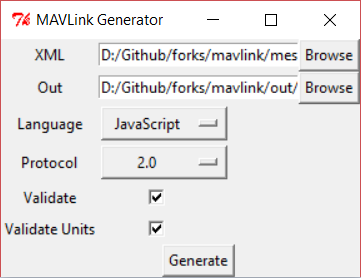

# Generating MAVLink Libraries

Language-specific MAVLink libraries can be created from [XML Message Definitions](../messages/README.md) using *code generator* tools.

MAVLink code generators exist for a number of [supported languages](../README.md#supported_languages) and MAVLink versions, provided by both this project and the broader community.

This topic explains how to use the two Python-based code generators provided by the MAVLink project: [mavgen](#mavgen) (command line) and [mavgenerate](#mavgenerate) (GUI).

> **Tip** Developers who are targetting the C programming language and the common set of messages (only) can use the [prebuilt libraries](../README.md#prebuilt_libraries) rather than generating them from XML.


## Preconditions

* The tools must already have been set up as described in [Install MAVLink](../getting_started/installation.md) (in particular *Tkinter* must be installed to use the GUI tool).
* If you're building a [dialect](../messages/README.md#dialects) file that depends on other XML files you must place your dialect in the same folder. Since most MAVLink dialects depend on the [common.xml](../messages/common.md) message set, this means that most dialect files will be placed in [message_definitions/v1.0/](https://github.com/mavlink/mavlink/tree/master/message_definitions/v1.0).

## MAVLink Generator Tool (GUI) {#mavgenerate}

*MAVLink Generator* (**mavgenerate.py**) is a MAVLink code generation tool GUI written in Python. It can be run from anywhere using Python's `-m` argument:

```sh
python -m mavgenerate
```



Generator Steps:
1. Choose the target XML file (typically in [mavlink/message_definitions/1.0](https://github.com/mavlink/mavlink/tree/master/message_definitions/1.0)).

   > **Note** If using a custom dialect, first copy it into the above directory (if the dialect is dependent on **common.xml** it must be located in the same directory).
1. Choose an output directory (e.g. **mavlink/include**).
1. Select the target output programming language.
1. Select the target MAVLink protocol version (ideally 2.0)
   > **Caution** Generation will fail if the protocol is not [supported](../README.md#supported_languages) by the selected programming language.
1. Optionally check *Validate* and/or  *Validate Units* (if checked validates XML specifications).
1. Click **Generate** to create the source files.


## Mavgen (Command Line) {#mavgen}

**mavgen.py** is a command-line interface for generating a language-specific MAVLink library. 
After the `mavlink` directory has been added to the `PYTHONPATH`, it can be run by executing from the command line. 

> **Tip** This is the backend used by [mavgenerate](#mavgenerate). The documentation below explains all the options for both tools. 

For example, to generate *MAVLink 2* C libraries for a dialect named **your_custom_dialect.xml**:
```sh
python -m pymavlink.tools.mavgen --lang=C --wire-protocol=2.0 --output=generated/include/mavlink/v2.0 message_definitions/v1.0/your_custom_dialect.xml
```

The full syntax can be output by running *mavgen* with the `-h` flag (reproduced below):
```
usage: mavgen.py [-h] [-o OUTPUT]
                 [--lang {C,CS,JavaScript,Python,WLua,ObjC,Swift,Java,C++11}]
                 [--wire-protocol {0.9,1.0,2.0}] [--no-validate]
                 [--error-limit ERROR_LIMIT] [--strict-units]
                 XML [XML ...]

This tool generate implementations from MAVLink message definitions

positional arguments:
  XML                   MAVLink definitions

optional arguments:
  -h, --help            show this help message and exit
  -o OUTPUT, --output OUTPUT
                        output directory.
  --lang {C,CS,JavaScript,Python,WLua,ObjC,Swift,Java,C++11}
                        language of generated code [default: Python]
  --wire-protocol {0.9,1.0,2.0}
                        MAVLink protocol version. [default: 1.0]
  --no-validate         Do not perform XML validation. Can speed up code
                        generation if XML files are known to be correct.
  --error-limit ERROR_LIMIT
                        maximum number of validation errors to display
  --strict-units        Perform validation of units attributes.
```
