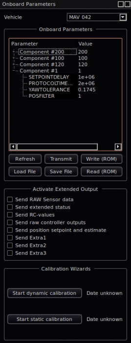

# Parameter Protocol

> **Caution** This content has not been fully reviewed since being ported from the old website (and may be out of date). Updates/re-validation welcome!

The parameter protocol is used to exchange key system settings and guarantees delivery.

It can be both implemented on a microcontroller (e.g. the pxIMU with ARM7) and in standard software (e.g. px_multitracker process in Linux).

## Supported Data Types

MAVLink (v1.0, v2.0) supports these data types:

* `uint32_t` - 32bit unsigned integer (use the ENUM value [MAV_PARAM_TYPE_UINT32](../messages/common.md#MAV_PARAM_TYPE_UINT32))
* `int32_t` - 32bit signed integer (use the ENUM value [MAV_PARAM_TYPE_INT32](../messages/common.md#MAV_PARAM_TYPE_INT32))
* `float` - IEEE754 single precision floating point number (use the ENUM value [MAV_PARAM_TYPE_FLOAT](../messages/common.md#MAV_PARAM_TYPE_FLOAT))

> **Note** All parameters are send as the float value of `mavlink_param_union_t`, which means that a parameter should be byte-wise converted with this union to a byte-wise float (no type conversion). This is necessary in order to not limit the maximum precision for scaled integer params. E.g. GPS coordinates can only be expressed with single float precision up to a few meters, while GPS coordinates in 1E7 scaled integers provide very high accuracy.

```c
mavlink_param_union_t param;

int32_t integer = 20000;

param.param_int32 = integer;
param.type = MAV_PARAM_TYPE_INT32;

// Then send the param by providing the float bytes to the send function
mavlink_msg_param_set_send(xx, xx, param.param_float, param.type, xx);
```

## Multi-System and Multi-Component Support

MAVLink supports multiple systems / airplanes in parallel on the same link. In addition to this, it also supports multiple MAVLink-enabled devices in the same airplane. The protocol for example allows to communicate over one radio link with the autopilot and a payload unit. For this reason the parameter protocol also differentiates between components. To get a complete parameter list from a system, send the request parameter message with `target_component` set to 0 (enum value: [MAV_COMP_ID_ALL](../messages/common.md#MAV_COMP_ID_ALL)). All onboard components should respond to parameter request messages with their ID or with ID `MAV_COMP_ID_ALL` (0). 

> **Tip** *QGroundControl* by default queries all components of a system (it only queries the currently selected system, not all systems) and therefore sends ID 0 (`MAV_COMP_ID_ALL`).


## Graphical User Interface in QGroundControl

For this reason the parameter interface *discriminates between systems (one system is one airplane) and components (one component is one entity in the architecture, e.g. the IMU or a Linux process).* This allows to transparently access the individual component parameters without the need of a central onboard unit that translates the parameter read/write requests for the onboard components.

As can be seen on the image below, each component is represented by a top-level node in the parameter tree. The system (the MAV) can be selected in the top-level drop-down menu. The GUI keeps track of changed parameters will send those parameters which changed to the appropriate components.



To facilitate the use of many parameters, the tree is structures at the top level according to the first underscore ("_") in the parameter name. So `PID_POS_X_P` and `PID_POS_Y_P` will be grouped below the `PID` node.


## Communication / State Machine

The onboard parameters are identified by a 16-char string (without `\0`) and store a floating point (IEE 754 single-precision, 4 bytes) value. This key->value pair has many important properties:

* The human-readable name is very helpful for users, yet it is still small enough
* The GCS does not have to know in advance what onboard parameters exist
* Support for unknown autopilots, as long as they implement the protocol, is guaranteed
* Adding a parameter is only a change to the onboard code.

### Read Parameters

Reading the parameter list is activated by sending the [PARAM_REQUEST_LIST](../messages/common.md#PARAM_REQUEST_LIST) message. The onboard component should start to transmit the parameters individually after receiving this message. The sending should be delayed after each parameter, in order to not use up the full radio bandwidth.


sequenceDiagram;
    participant GCS
    participant Drone
    GCS->>Drone: PARAM_REQUEST_LIST
    Drone->>Drone: Start sending parameters
    Drone->>GCS: Send N parameters
    GCS->>GCS: Start receive timeout
    GCS->>Drone: Request dropped params with PARAM_REQUEST_READ


### Read Single Parameter

A single parameter can be read by the [PARAM_REQUEST_READ](../messages/common.md#PARAM_REQUEST_READ) message.


### Write Parameters

As a GCS does not have its own list of the parameters on startup, before writing a parameter first the parameter list has to be read once. After that, parameters can be written individually by sending the key->value pair to the component. Provided the GCS keeps track of changed parameters, it will only need to transmit those which have changed in value. The Drone (MAV) **has to acknowledge the write operation** by emitting a [PARAM_REQUEST_READ](../messages/common.md#PARAM_VALUE)  value message with the newly written parameter value.


sequenceDiagram;
    participant GCS
    participant Drone
    GCS->>Drone: Semd parameter name and value
    GCS->>GCS: Start timeout for receiving update value/ACK
    Drone->>GCS: Send updated values
    GCS->>Drone: If loss occurs: restart write transmission.



## QGroundControl Parameter Files

*QGroundControl* can save the current values of the onboard parameters in a text file. The file can then be imported again and transmitted to the Drone. This allows to e.g. configure several vehicles completely similar with safe default values.
